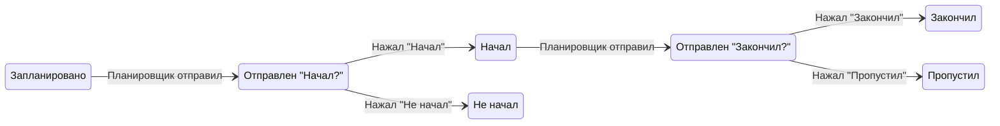

# Доменная модель

## 1. Сущности (MVP)

### 1.1 User (Пользователь)
- **Идентификация**: `telegram_user_id` (уникальный в системе).
- **Атрибуты**: `timezone` (IANA, например `Europe/Moscow`), `created_at`.
- Связь: один пользователь — один аккаунт Telegram; после привязки доступ и к сайту, и к боту.

### 1.2 ScheduleTemplate (Шаблон расписания)
- Принадлежит пользователю (`user_id`).
- В MVP: один активный шаблон на пользователя (или единственный шаблон).
- Атрибуты: `name` (опционально), `id`.

### 1.3 PlanItem (Элемент плана)
- Принадлежит шаблону (`template_id`).
- **kind**: `task` | `event`.
- **TaskItem (дело)**:
  - Одна точка времени: `start_time` (время в рамках дня в локальном времени пользователя), `end_time` не используется или равно `start_time`.
  - Дни недели: `days_of_week` (массив 1–7, ISO: 1=пн, 7=вс).
  - **Название**: `title` — обязательно, задаётся пользователем.
- **EventItem (событие)**:
  - Блок времени: `start_time`, `end_time` (в рамках дня).
  - Дни недели: `days_of_week`.
  - **activity_id** — обязателен, связь с активностью (без него бот не работает: пауза, трекинг).
  - **Название**: `title` — не задаётся пользователем, берётся из `activity.name` при создании/обновлении.

### 1.4 Activity (Активность)
- Каталог активностей пользователя (`user_id`).
- Атрибуты: `name`, `kind` (например, `hotkey` | `regular`).
- **Hotkey**: отображается как кнопка в боте, можно стартовать/останавливать сессии.
- **Regular**: активность без кнопки в боте (для расписания или будущего ручного ввода).

### 1.5 Hotkey (Быстрая кнопка)
- Связь пользователя и активности: `user_id`, `activity_id`.
- Атрибуты: `label` (текст на кнопке), `order` (порядок отображения).

### 1.6 Notification (Уведомление / запланированная отправка)
- Конкретный экземпляр «что отправить и когда»: `user_id`, `plan_item_id` (или ссылка на тип и дату), `planned_at` (UTC), `type` (например, `task_prompt`, `event_start`, `event_end`).
- **idempotency_key**: уникальный ключ (например, `plan_item_id + date + type`), чтобы не отправить дубликат и не создать дубликат записи при обработке ответа.
- После отправки: `sent_at` (UTC), при необходимости ссылка на `message_id` Telegram.

### 1.7 LogEntry (Факт ответа/действия)
- Запись о действии пользователя (точечные ответы на пуши).
- Атрибуты: `user_id`, `responded_at` (UTC), `action`, `payload`.
- Связи (опционально): `plan_item_id`, `activity_id`, `planned_at`.
- **action**: `task_done` | `task_not_done` | `task_skipped` | `event_skipped` | `event_not_started` — ответы на пуши. Источник правды по длительности — TimeSegment, не LogEntry.
- Инвариант: по одному idempotency_key не создаётся более одной записи LogEntry.

### 1.8 TimeSegment (Временной отрезок трекинга)
- Отрезок времени работы над активностью (hotkey или запланированное событие).
- Атрибуты: `user_id`, `activity_id`, `plan_item_id` (опционально, для событий), `started_at` (UTC), `ended_at` (NULL пока отрезок активен).
- Пауза = закрыть текущий отрезок (`ended_at`); продолжение = создать новый отрезок.
- Инвариант: у пользователя не более одного отрезка с `ended_at IS NULL` для одной и той же `activity_id` (или для пары `user_id` + `plan_item_id` при событиях).

### 1.9 LinkCode (Код привязки)
- Временный код для связки веб-сессии с Telegram.
- Атрибуты: `code` (уникальный), `web_session_id` (или анонимный идентификатор с сайта), `expires_at`, `consumed_at` (NULL до использования), `telegram_user_id` (заполняется при consume).

## 2. Состояния события (EventItem) в течение дня

Жизненный цикл события с точки зрения пушей и ответов:

```text
planned → prompted_start → started | not_started
                ↓
         (если started) → prompted_end → ended | skipped
```

- **planned**: элемент расписания запланирован на дату (есть запись в развёрнутом плане / Notification для старта и для конца).
- **prompted_start**: отправлен пуш «Начал?»; ожидается ответ.
- **started** / **not_started**: пользователь нажал «Начал» или «Не начал»; фиксируется `responded_at`.
- **prompted_end**: отправлен пуш «Закончил?» (в плановое время конца).
- **ended** / **skipped**: пользователь нажал «Закончил» или «Пропустил»; фиксируется `responded_at`.

Состояние дела (TaskItem) проще: **planned → prompted → done | not_done | skipped** (один пуш, один ответ).

## 3. Диаграмма состояний (событие)



## 4. Связи между сущностями (кратко)

- **User** → ScheduleTemplate(s), Activity(ies), Hotkey(s), LogEntry(ies), TimeSegment(s), LinkCode(s) (временные).
- **ScheduleTemplate** → PlanItem(s).
- **PlanItem** → Activity (обязательно для event, опционально для task).
- **Notification** → User, PlanItem.
- **LogEntry** → User; опционально PlanItem, Activity.
- **TimeSegment** → User, Activity; опционально PlanItem (для событий).

## 5. Схема данных (подробно)

| Таблица | Поле | Тип | Описание |
|---------|------|-----|----------|
| **users** | id | bigint PK | Идентификатор |
| | telegram_user_id | bigint UNIQUE | ID в Telegram |
| | timezone | varchar(64) | IANA timezone (Europe/Moscow) |
| | created_at | timestamptz | Дата создания |
| **link_codes** | id | bigint PK | |
| | code | varchar(64) UNIQUE | Код привязки |
| | web_session_id | varchar(256) | ID веб-сессии |
| | expires_at | timestamptz | Срок действия |
| | consumed_at | timestamptz NULL | Время использования |
| | telegram_user_id | bigint NULL | Привязка к Telegram |
| **activities** | id | bigint PK | |
| | user_id | bigint FK | Владелец |
| | name | varchar(256) | Название |
| | kind | varchar(32) | hotkey \| regular |
| **hotkeys** | id | bigint PK | |
| | user_id | bigint FK | |
| | activity_id | bigint FK | |
| | label | varchar(128) | Подпись на кнопке |
| | order | int | Порядок отображения |
| **schedule_templates** | id | bigint PK | |
| | user_id | bigint FK | |
| | name | varchar(256) | Название шаблона |
| **plan_items** | id | bigint PK | |
| | template_id | bigint FK | |
| | kind | varchar(32) | task \| event |
| | title | varchar(512) | Название (для event — из activity) |
| | start_time | time | Время начала (локальное) |
| | end_time | time | Время конца |
| | days_of_week | smallint[] | 1–7 (ISO) |
| | activity_id | bigint FK NULL | Обязателен для event |
| **notifications** | id | bigint PK | |
| | user_id | bigint FK | |
| | plan_item_id | bigint FK | |
| | planned_at | timestamptz | Время отправки (UTC) |
| | type | varchar(32) | task_prompt \| event_start \| event_end |
| | sent_at | timestamptz NULL | Факт отправки |
| | idempotency_key | varchar(256) UNIQUE | Ключ идемпотентности |
| **log_entries** | id | bigint PK | |
| | user_id | bigint FK | |
| | plan_item_id | bigint FK NULL | |
| | activity_id | bigint FK NULL | |
| | planned_at | timestamptz NULL | |
| | responded_at | timestamptz | Время ответа |
| | action | varchar(64) | task_done, task_skipped и т.д. |
| | payload | jsonb NULL | Доп. данные |
| **time_segments** | id | bigint PK | |
| | user_id | bigint FK | |
| | activity_id | bigint FK | |
| | plan_item_id | bigint FK NULL | Для событий |
| | started_at | timestamptz | Начало отрезка |
| | ended_at | timestamptz NULL | Конец (NULL = активен) |
| **bug_report_drafts** | id | bigint PK | Черновики баг-репортов |
| | user_id | bigint FK | |
| | telegram_user_id | bigint | |
| | description | varchar(4096) | |
| | state | varchar(32) | waiting_description \| waiting_confirm \| sent \| cancelled |
| | created_at, updated_at | timestamptz | |
| | github_issue_url | varchar(512) NULL | |

## 6. API-схемы (PlanItem)

**PlanItemCreate** (POST `/schedule/template/{id}/items`):
- `kind`: `task` | `event` (обязательно)
- `title`: str, опционально — для task обязателен, для event не передаётся (берётся из activity)
- `start_time`, `end_time`: HH:MM или HH:MM:SS
- `days_of_week`: [1–7]
- `activity_id`: int, для event обязателен

**PlanItemUpdate** (PATCH `/schedule/plan-items/{id}`):
- `title`, `start_time`, `end_time`, `days_of_week`, `activity_id` — опционально
- Для event: `activity_id` нельзя сбросить в null; при смене activity_id title обновляется из новой активности

**PlanItemResponse**:
- `id`, `template_id`, `kind`, `title`, `start_time`, `end_time`, `days_of_week`, `activity_id`

## 7. Ссылки

- Требования к полям и идемпотентности: [requirements.md](requirements.md).
- Схема хранилища: [system-design.md](system-design.md#хранилище-данных).
