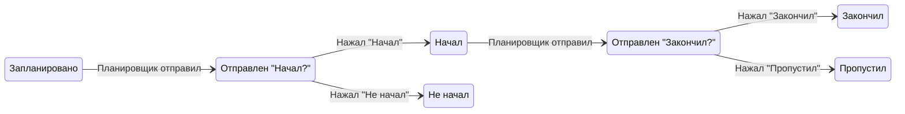

# Доменная модель

## 1. Сущности (MVP)

### 1.1 User (Пользователь)
- **Идентификация**: `telegram_user_id` (уникальный в системе).
- **Атрибуты**: `timezone` (IANA, например `Europe/Moscow`), `created_at`.
- Связь: один пользователь — один аккаунт Telegram; после привязки доступ и к сайту, и к боту.

### 1.2 ScheduleTemplate (Шаблон расписания)
- Принадлежит пользователю (`user_id`).
- В MVP: один активный шаблон на пользователя (или единственный шаблон).
- Атрибуты: `name` (опционально), `id`.

### 1.3 PlanItem (Элемент плана)
- Принадлежит шаблону (`template_id`).
- **kind**: `task` | `event`.
- **TaskItem (дело)**:
  - Одна точка времени: `start_time` (время в рамках дня в локальном времени пользователя), `end_time` не используется или равно `start_time`.
  - Дни недели: `days_of_week` (например, битмаска или массив 1–7).
  - Название: `title`.
- **EventItem (событие)**:
  - Блок времени: `start_time`, `end_time` (в рамках дня).
  - Дни недели: `days_of_week`.
  - Название: `title`.
- Опционально: `activity_id` — связь с активностью (для учёта в отчётах и будущих расширениях).

### 1.4 Activity (Активность)
- Каталог активностей пользователя (`user_id`).
- Атрибуты: `name`, `kind` (например, `hotkey` | `regular`).
- **Hotkey**: отображается как кнопка в боте, можно стартовать/останавливать сессии.
- **Regular**: активность без кнопки в боте (для расписания или будущего ручного ввода).

### 1.5 Hotkey (Быстрая кнопка)
- Связь пользователя и активности: `user_id`, `activity_id`.
- Атрибуты: `label` (текст на кнопке), `order` (порядок отображения).

### 1.6 Notification (Уведомление / запланированная отправка)
- Конкретный экземпляр «что отправить и когда»: `user_id`, `plan_item_id` (или ссылка на тип и дату), `planned_at` (UTC), `type` (например, `task_prompt`, `event_start`, `event_end`).
- **idempotency_key**: уникальный ключ (например, `plan_item_id + date + type`), чтобы не отправить дубликат и не создать дубликат записи при обработке ответа.
- После отправки: `sent_at` (UTC), при необходимости ссылка на `message_id` Telegram.

### 1.7 LogEntry (Факт ответа/действия)
- Запись о действии пользователя.
- Атрибуты: `user_id`, `responded_at` (UTC), `action`, `payload`.
- Связи (опционально в зависимости от типа):
  - Для ответа на пуш: `plan_item_id`, `planned_at`, `notification_id` или idempotency_key в payload; `action` = `task_done` | `task_not_done` | `task_skipped` | `event_started` | `event_not_started` | `event_ended` | `event_skipped`.
  - Для hotkey: `activity_id`, `action` = `session_start` | `session_end`; в payload или отдельно — `session_id`, длительность.
- Инвариант: по одному idempotency_key (или notification_id) не создаётся более одной записи LogEntry для одного и того же типа ответа.

### 1.8 ActiveSession (Сессия интервала)
- Текущий незавершённый интервал по hotkey-активности.
- Атрибуты: `user_id`, `activity_id`, `started_at` (UTC), `ended_at` (NULL пока сессия активна).
- Инвариант: у пользователя не более одной записи с `ended_at IS NULL` для одной и той же `activity_id`.

### 1.9 LinkCode (Код привязки)
- Временный код для связки веб-сессии с Telegram.
- Атрибуты: `code` (уникальный), `web_session_id` (или анонимный идентификатор с сайта), `expires_at`, `consumed_at` (NULL до использования), `telegram_user_id` (заполняется при consume).

## 2. Состояния события (EventItem) в течение дня

Жизненный цикл события с точки зрения пушей и ответов:

```text
planned → prompted_start → started | not_started
                ↓
         (если started) → prompted_end → ended | skipped
```

- **planned**: элемент расписания запланирован на дату (есть запись в развёрнутом плане / Notification для старта и для конца).
- **prompted_start**: отправлен пуш «Начал?»; ожидается ответ.
- **started** / **not_started**: пользователь нажал «Начал» или «Не начал»; фиксируется `responded_at`.
- **prompted_end**: отправлен пуш «Закончил?» (в плановое время конца).
- **ended** / **skipped**: пользователь нажал «Закончил» или «Пропустил»; фиксируется `responded_at`.

Состояние дела (TaskItem) проще: **planned → prompted → done | not_done | skipped** (один пуш, один ответ).

## 3. Диаграмма состояний (событие)



## 4. Связи между сущностями (кратко)

- **User** → ScheduleTemplate(s), Activity(ies), Hotkey(s), LogEntry(ies), ActiveSession(s), LinkCode(s) (временные).
- **ScheduleTemplate** → PlanItem(s).
- **PlanItem** → Activity (опционально).
- **Notification** → User, PlanItem (или эквивалент по дате/типу).
- **LogEntry** → User; опционально PlanItem, Activity, Notification.
- **ActiveSession** → User, Activity.

## 5. Ссылки

- Требования к полям и идемпотентности: [requirements.md](requirements.md).
- Схема хранилища: [system-design.md](system-design.md#хранилище-данных).
