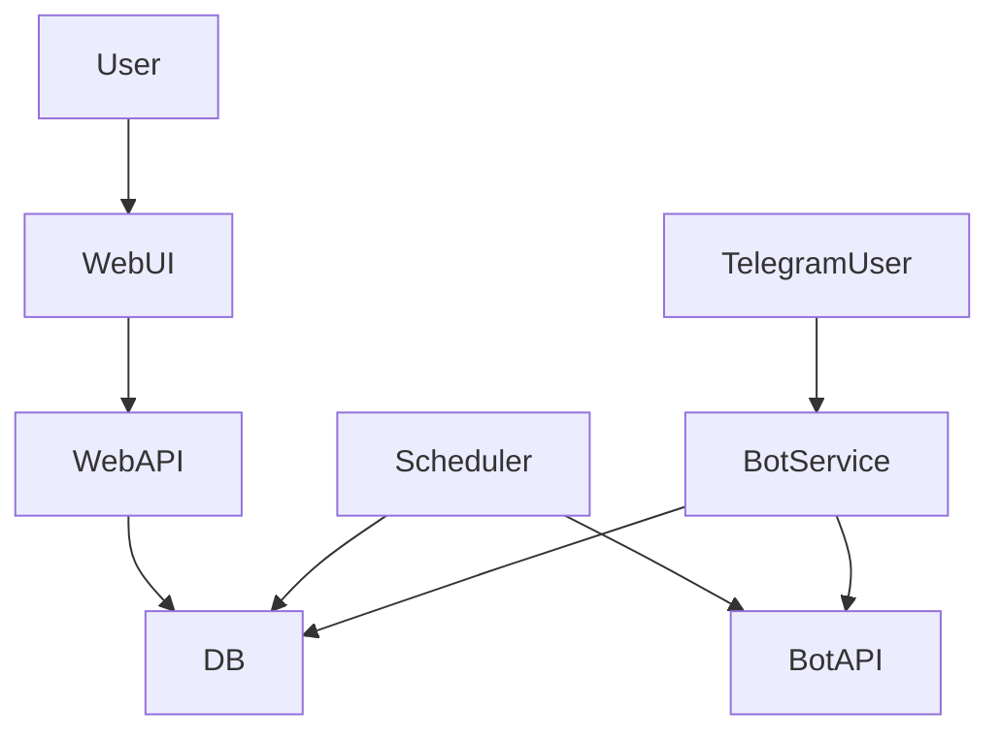

## Расположение документации

Вся документация (требования, системный дизайн, схемы UI, доменная модель) сохраняется в папку `**docs/**` в корне проекта. При реализации спеки создавать и обновлять файлы именно там.

Пример структуры: `docs/prd.md`, `docs/requirements.md`, `docs/domain-model.md`, `docs/system-design.md`, `docs/ui-telegram.md`, `docs/ui-web.md` (или объединённый `docs/ui-schematics.md`) — точный набор файлов можно зафиксировать на этапе реализации.

## Цели и границы

- **Цель**: трекать активности в течение дня по заранее заданному расписанию и по быстрым кнопкам в Telegram.
- **Основной сценарий (MVP)**:
  - Веб: пользователь настраивает расписание (временные блоки), список активностей/кнопок, правила пушей.
  - Бот: по расписанию задаёт вопросы; пользователь отвечает; система фиксирует **время нажатия ответа** и статус.
  - Бот: быстрые кнопки для старт/стоп интервалов (например, YouTube).

## Термины и доменная модель (MVP)

- **Пользователь (User)**: идентифицируется Telegram `telegram_user_id`.
- **План (ScheduleTemplate)**: набор элементов на день/неделю.
- **Элемент плана (PlanItem)**: то, что должно произойти.
  - **Дело (TaskItem)**: одноразовая отметка (вопрос “сделал/не сделал”). Есть плановое время/окно.
  - **Событие (EventItem)**: интервальная активность (вопросы “начал/не начал” и позже “закончил/пропустил”). Есть плановое начало и плановая длительность/конец.
- **Активность (Activity)**: каталог активностей (YouTube, Учёба, Тренировка…).
  - **HotkeyActivity**: активность, которую можно быстро запускать/останавливать кнопкой в боте.
  - **NonHotkeyActivity**: активность доступна для ручного добавления/будущих сценариев, но без закреплённой кнопки.
- **Факт (LogEntry)**: запись о том, что пользователь ответил/нажал.
  - Для TaskItem: `planned_at`, `responded_at`, `answer` (done / not_done / skipped).
  - Для EventItem: отдельно факты `start` и `end` (или единая сущность с `started_at`, `ended_at`, но события “плановый старт” и “плановый финиш” должны быть отслеживаемы).
- **Сессия интервала (ActiveSession)**: текущий “идёт прямо сейчас” интервал для hotkey‑активности (чтобы знать, что именно можно остановить).

## Пользовательский путь (MVP)

- **Онбординг**
  - Пользователь заходит на сайт → “Авторизация через Telegram”.
  - Сайт показывает кнопку/ссылку “Открыть бота и подтвердить” (deep-link `t.me/<bot>?start=<code>`).
  - Пользователь открывает бота → `/start <code>` → аккаунт привязан.
  - После привязки сайт получает подтверждение и открывает настройки.
- **Настройка на сайте**
  - Редактор расписания: блоки времени (например, 09:00–11:00 Учёба) и дела (например, 07:00 Подъём) + вложенные подпункты (как чеклист) опционально.
  - Настройка пушей: включить/выключить, часовой пояс, “тихие часы”.
  - Настройка hotkey‑кнопок (например, YouTube): поведение кнопки (start/stop), отображение.
- **День пользователя в боте**
  - В заданное плановое время бот присылает вопрос.
  - Пользователь нажимает “Сделал/Не сделал” или “Начал/Не начал”, а позже “Закончил/Пропустил”.
  - Система сохраняет **planned_at** и **responded_at** (время клика), плюс статус.
  - Для hotkey‑кнопок: “YouTube ▶︎” запускает интервал (фиксируем `started_at`), “YouTube ■” завершает (`ended_at`).
  - Пользователь может **получить список незавершённых активностей** (команда или кнопка): бот показывает текущие сессии (что сейчас "идёт") с возможностью завершить любую из них.

## Функциональные требования (MVP)

- **Авторизация/связка**
  - Связать веб‑сессию с Telegram пользователем через одноразовый код (TTL), подтверждённый в боте.
  - Защита от повторного использования кода.
- **Управление расписанием**
  - CRUD шаблонов расписания.
  - Элементы: TaskItem (точка времени), EventItem (временной блок).
  - Повторение минимум: **по дням недели**.
  - Учёт часового пояса пользователя.
- **Пуши в Telegram**
  - Планировщик отправляет сообщения по `planned_at`.
  - Для TaskItem: варианты ответа done/not_done (и опционально “пропустить”).
  - Для EventItem: два этапа: стартовый вопрос и финишный вопрос.
  - Любой ответ должен фиксировать `responded_at`.
- **Hotkey‑кнопки**
  - Пользователь на сайте настраивает список кнопок.
  - В боте есть меню/клавиатура с этими кнопками.
  - Нажатие кнопки стартует интервал, повторное нажатие завершает (или отдельные “Начать/Закончить” — на уровне реализации).
  - Нельзя иметь две активные сессии одной и той же активности одновременно.
- **Список незавершённых активностей (в боте)**
  - Пользователь может запросить список активных сессий (команда, например `/active`, или кнопка "Что сейчас идёт").
  - Бот возвращает список: название активности + время старта (опционально — уже прошло времени).
  - Для каждой позиции — кнопка "Закончить", чтобы завершить сессию и зафиксировать `ended_at`.
- **Просмотр результатов (минимум)**
  - Веб: список фактов за день (что планировалось и что ответили) + длительности по интервалам.

## Документация UI (схемы)

В составе требований/спеки должны быть **схематические отрисовки элементов интерфейса** (wireframes/схемы экранов), чтобы однозначно задать состав и расположение элементов.

- **Telegram (бот)**
  - Онбординг: приветствие, запрос кода, подтверждение привязки.
  - Пуш-сообщения: вопрос по делу (текст + кнопки "Сделал" / "Не сделал" / "Пропустить"); вопрос по событию — старт ("Начал" / "Не начал") и финиш ("Закончил" / "Пропустил").
  - Клавиатура/меню: быстрые кнопки (hotkeys), кнопка "Что сейчас идёт" (или команда `/active`).
  - Экран "Незавершённые активности": список сессий (название + время старта) + кнопки "Закончить" по каждой.
- **Веб**
  - Страница входа: кнопка "Войти через Telegram", отображение кода и ссылки на бота.
  - Редактор расписания: список блоков/дел, добавление/редактирование (время, название, тип — дело/событие), привязка к дням недели.
  - Настройки пушей: вкл/выкл, часовой пояс, тихие часы.
  - Настройка hotkey-кнопок: список активностей, добавление кнопки (название, иконка/метка), порядок.
  - Отчёт за день: список запланированного и фактов (время ответа, статус), длительности интервалов.

Формат: ASCII/псевдографика, Mermaid-диаграммы блоков или отдельные wireframe-скетчи (например, в Markdown с описанием блоков). Цель — чтобы по схеме можно было реализовать экран без двусмысленностей.

## Нефункциональные требования (MVP)

- **Надёжность**: отправки и обработка ответов идемпотентны (повторные апдейты/дубли не ломают состояние).
- **Время**: хранить все времена в UTC + отдельным полем `timezone` у пользователя.
- **Безопасность**: минимальные персональные данные; токены/коды с TTL; подпись webhook запросов (если применимо).
- **Наблюдаемость**: структурные логи, корреляционный id для сценария “пуш → ответ”.

## Архитектура (высокоуровневая)

- **Web App (HTTP API + UI)**
  - UI (простая): настройки расписания и кнопок, просмотр дня.
  - API: CRUD расписаний, активностей, кнопок, отчётов.
- **Telegram Bot Service**
  - Приём апдейтов (webhook или long-polling).
  - Отправка сообщений/клавиатур.
  - Обработка callback’ов (ответы, нажатия кнопок).
- **Scheduler/Worker**
  - Периодически планирует и отправляет пуши, основываясь на расписании.
  - Ретраи отправки.
- **Database**
  - PostgreSQL (рекомендация). Для локального MVP можно SQLite, но планировщик/конкурентность проще с Postgres.
- **Queue/Cache (опционально для MVP)**
  - Redis + Celery/RQ (если хотим вынести фоновые задачи). Иначе — APScheduler в отдельном процессе.

### Потоки данных (MVP)

## Разбиение на компоненты (для “вайбкодинга”) и интерфейсы

Ниже — список автономных модулей, каждый можно делать отдельно, с чёткими входами/выходами.

- `**auth_linking**` (связка сайта и Telegram)
  - Вход: `create_link_code(web_session_id) -> code`
  - Вход: `consume_link_code(code, telegram_user_id) -> user_id`
  - Выход/инварианты: TTL, одноразовость, аудит.
- `**schedule_model**` (домен расписаний)
  - DTO/модели: `TaskItem`, `EventItem`, `ScheduleTemplate`, `DayOfWeek`.
  - Функции: `expand_template(user_id, date) -> PlannedItems[]`.
- `**planning_engine**` (что и когда пушить)
  - Вход: PlannedItems за дату/окно.
  - Выход: список `NotificationJob` (когда/что отправить, ключ идемпотентности).
- `**bot_messages**` (рендер сообщений/кнопок)
  - Вход: `build_task_prompt(task_planned) -> Message`
  - Вход: `build_event_start_prompt(event_planned) -> Message`
  - Вход: `build_event_end_prompt(event_planned) -> Message`
  - Вход: `build_hotkeys_keyboard(user_id) -> Keyboard`
  - Вход: `build_active_sessions_message(sessions: list[ActiveSession]) -> Message` и `build_finish_buttons(sessions) -> Keyboard` — для экрана «незавершённые активности».
- `**bot_handlers**` (обработка ответов)
  - Вход: callback payload.
  - Выход: `LogEntry` (с `responded_at=now()`), переходы состояния событий.
- `**hotkey_sessions**` (интервалы по кнопкам)
  - Вход: `start_session(user_id, activity_id, now) -> session_id`
  - Вход: `stop_session(user_id, activity_id, now) -> duration`
  - Вход: `list_active_sessions(user_id) -> list[ActiveSession]` — список незавершённых сессий (для отображения в боте и кнопок «Закончить»).
  - Инварианты: одна активная сессия на activity/user.
- `**reporting**`
  - Вход: `get_daily_report(user_id, date) -> {planned, answers, durations}`.
- `**storage**`
  - Репозитории: `UsersRepo`, `ScheduleRepo`, `ActivityRepo`, `LogsRepo`, `SessionsRepo`.

## Зависимости (Python стек, рекомендованные)

- **Web/API**: FastAPI, Pydantic, Uvicorn.
- **DB**: SQLAlchemy 2.x, Alembic, PostgreSQL драйвер (`psycopg`).
- **Bot**: aiogram (или python-telegram-bot; выбрать один и зафиксировать).
- **Фоновые задачи**: APScheduler (просто) или Celery + Redis (надёжнее при росте).
- **Конфиг**: pydantic-settings.
- **Логи**: structlog или стандартный logging + JSON formatter.

## Хранилище данных (черновая схема сущностей)

- `users(id, telegram_user_id, timezone, created_at)`
- `link_codes(code, web_session_id, expires_at, consumed_at, telegram_user_id)`
- `activities(id, user_id, name, kind)`
- `hotkeys(id, user_id, activity_id, label, order)`
- `schedule_templates(id, user_id, name)`
- `plan_items(id, template_id, kind, title, start_time, end_time, days_of_week, activity_id?)`
- `notifications(id, user_id, plan_item_id, planned_at, type, sent_at, idempotency_key)`
- `log_entries(id, user_id, plan_item_id?, activity_id?, planned_at?, responded_at, action, payload)`
- `active_sessions(id, user_id, activity_id, started_at, ended_at?)`

## Важные решения/оговорки

- **Фиксируем два времени**: `planned_at` (когда ожидалось) и `responded_at` (когда нажали).
- **Часовой пояс** обязателен: расписание вводится в локальном времени пользователя, хранится/планируется корректно.
- **Идемпотентность**: callback payload содержит `notification_id`/`idempotency_key`, чтобы повтор не создавал дубли.

## Расширения (после MVP)

- Snooze/перенос, окна допустимого ответа (grace period), автозавершение события по плановому концу.
- Несколько шаблонов (будни/выходные), исключения по датам.
- Аналитика: цели, streak’и, диаграммы.
- Импорт/экспорт расписания (YAML/JSON), версияция.

