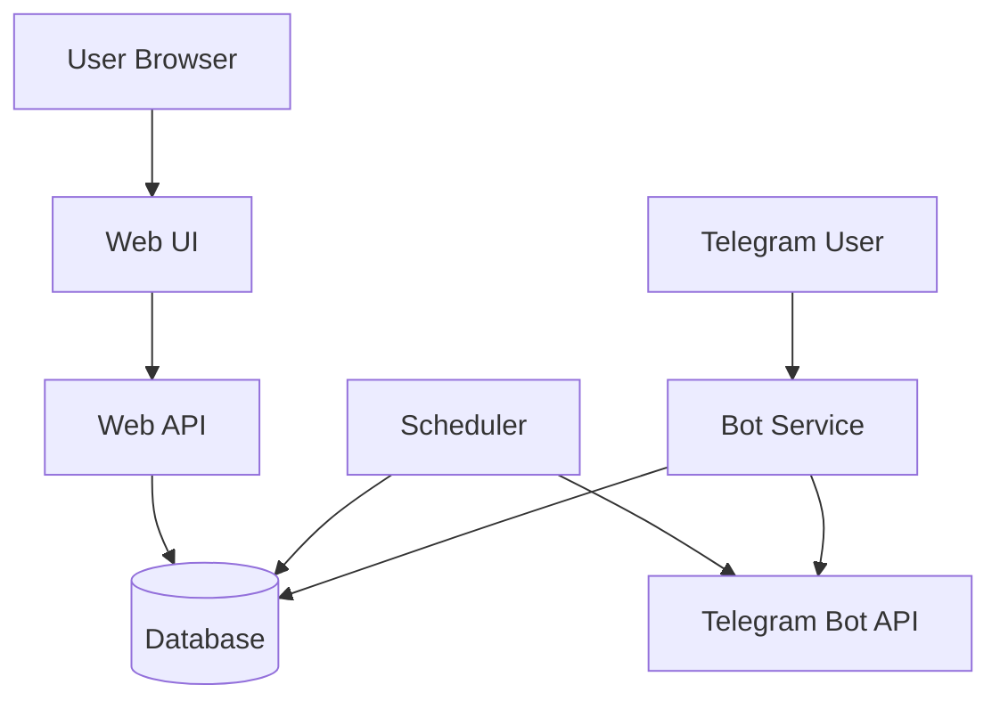

# Системный дизайн

## 1. Обзор архитектуры

Система состоит из трёх основных частей: **веб-приложение** (API + UI), **Telegram-бот** и **планировщик/воркер** отправки пушей. Все они работают с общей **базой данных**.

## 2. Компоненты системы

### 2.1 Web App (HTTP API + UI)
- **Назначение**: авторизация (выдача кода привязки, ожидание подтверждения), настройка расписания, активностей и hotkey-кнопок, просмотр отчёта за день.
- **API**: REST или близкий к REST; CRUD для шаблонов, элементов плана, активностей, hotkeys; эндпоинт отчёта за дату; создание кода привязки и проверка статуса привязки.
- **UI**: страницы входа, редактора расписания, настроек пушей, настроек hotkey, отчёта. Данные через API.

### 2.2 Telegram Bot Service
- **Назначение**: приём апдейтов (сообщения, callback_query), отправка сообщений и клавиатур.
- **Вход**: webhook (POST от Telegram) или long polling. Рекомендация для продакшена: webhook за reverse proxy с HTTPS.
- **Обработка**: команда `/start <code>` — потребление кода привязки; callback от кнопок пушей — запись LogEntry, обновление сообщения; нажатия hotkey — старт/стоп сессии; команда `/active` или кнопка «Что сейчас идёт» — вывод списка активных сессий и кнопок «Закончить».
- **Исходящие вызовы**: отправка сообщений и редактирование через Bot API; все времена при планировании — в UTC.

### 2.3 Scheduler / Worker
- **Назначение**: в заданное время (по расписанию пользователей в UTC) формировать и отправлять пуш-сообщения в Telegram.
- **Вход**: расписание (развёрнутые элементы плана на дату) и настройки пользователей (timezone, вкл/выкл пушей).
- **Логика**: периодически (например, раз в минуту) или по таймеру «следующее событие» выбирать уведомления с `planned_at <= now` и ещё не отправленные; для каждого вызвать Bot API, сохранить `sent_at` и idempotency_key, чтобы не отправить повторно.
- **Ретраи**: при временной ошибке Telegram — повтор с задержкой; при «user blocked bot» — не ретраить, залогировать.

## 3. Потоки данных

### 3.1 Привязка аккаунта
1. Пользователь на сайте нажимает «Войти через Telegram».
2. Web API создаёт `LinkCode`, возвращает код и ссылку `t.me/<bot>?start=<code>`.
3. Фронт показывает код и ссылку; опционально опрашивает API «статус привязки» по session/коду.
4. Пользователь в боте: `/start <code>`. Бот вызывает сервис привязки: `consume_link_code(code, telegram_user_id)`.
5. Создаётся/находится User, код помечается использованным. Бот отвечает «Вы привязаны».
6. Сайт при следующем опросе получает «привязан» и перенаправляет в настройки (или обновляет страницу).

### 3.2 Отправка пуша
1. Scheduler читает из БД или кэша список «Notification» с `planned_at <= now` и без `sent_at`.
2. Для каждого: сформировать текст и клавиатуру (компонент bot_messages), отправить сообщение в Telegram, записать `sent_at` и при необходимости `message_id`/idempotency_key.
3. При ошибке: ретрай по политике; при успехе — больше не отправлять этот экземпляр.

### 3.3 Обработка ответа на пуш
1. Telegram присылает `callback_query` с `callback_data` (в пределах 64 байт).
2. Бот парсит payload (например, тип + notification_id или idempotency_key).
3. Проверка идемпотентности: уже есть LogEntry по этому ключу? Если да — ответить `answer_callback_query`, при необходимости отредактировать сообщение («Уже учтено»), выйти.
4. Иначе: записать LogEntry с `responded_at=now()`, обновить сообщение в чате (убрать кнопки или показать «Учтено»), вызвать `answer_callback_query`.

### 3.4 Hotkey и события: старт/стоп/пауза и список активных
1. Нажатие кнопки активности: если активного отрезка нет — создать TimeSegment; иначе — завершить (`ended_at=now()`). Пауза = закрыть отрезок; продолжение = создать новый (перерыв не учитывается в длительности).
2. `/active` или «Что сейчас идёт»: прочитать активные TimeSegment (с `ended_at IS NULL`), сформировать сообщение и inline-кнопки «Закончить» / «Пауза» по каждому отрезку. Callback привязан к segment_id или activity_id, обработка идемпотентна.

## 4. Хранилище данных

Рекомендуемая СУБД: **PostgreSQL**. Для локальной разработки допустим SQLite с учётом ограничений (конкурентность, блокировки).

### 4.1 Таблицы

| Таблица | Ключевые поля |
|--------|----------------|
| `users` | id, telegram_user_id (unique), timezone, created_at |
| `link_codes` | code (unique), web_session_id, expires_at, consumed_at, telegram_user_id |
| `activities` | id, user_id, name, kind (hotkey \| regular) |
| `hotkeys` | id, user_id, activity_id, label, order |
| `schedule_templates` | id, user_id, name |
| `plan_items` | id, template_id, kind, title, start_time, end_time, days_of_week, activity_id (nullable) |
| `notifications` | id, user_id, plan_item_id, planned_at, type, sent_at, idempotency_key (unique) |
| `log_entries` | id, user_id, plan_item_id, activity_id, planned_at, responded_at, action, payload |
| `time_segments` | id, user_id, activity_id, plan_item_id (nullable), started_at, ended_at (nullable) |
| `bug_report_drafts` | id, user_id, telegram_user_id, description, state, created_at, updated_at, github_issue_url |

### 4.2 Схема plan_items (детали)

- **kind**: `task` — дело (одна точка времени); `event` — событие (блок времени).
- **title**: для task — задаётся пользователем; для event — берётся из `activity.name`, не редактируется вручную.
- **activity_id**: для event обязателен (пауза, трекинг в боте); для task опционально.

### 4.3 Индексы

- `telegram_user_id`, `user_id` в связанных таблицах.
- `planned_at`, `sent_at`, `idempotency_key` для планировщика и идемпотентности.
- `(user_id, activity_id, ended_at)` для активных отрезков (time_segments).

## 5. Планировщик: варианты реализации

### 5.1 APScheduler (рекомендация для MVP)
- **Плюсы**: один процесс, простота, не требует Redis. Можно использовать `AsyncIOScheduler` с триггером «интервал» (например, каждые 60 секунд): просмотр таблицы `notifications` (или эквивалента) на записи с `planned_at <= now()` и `sent_at IS NULL`.
- **Хранение заданий**: либо не хранить в APScheduler job store (задачи «что отправить» лежат в БД), либо использовать SQLAlchemy job store для «разовых» job’ов. Для MVP проще держать «что отправить» только в БД и раз в N секунд выбирать и отправлять.
- **Минусы**: при нескольких инстансах приложения нужна блокировка (например, advisory lock в Postgres или выборка с `FOR UPDATE SKIP LOCKED`), чтобы один и тот же пуш не отправили два воркера.

### 5.2 Celery + Redis
- **Плюсы**: распределённая очередь, ретраи, масштабирование воркеров.
- **Идея**: планировщик (cron или Celery Beat) ставит в очередь задачи «отправить пуш для notification_id» на время `planned_at`; воркер выполняет отправку и записывает `sent_at`.
- **Минусы**: дополнительная инфраструктура (Redis, Celery worker); для MVP может быть избыточно.

Итог: для MVP достаточно **одного процесса с APScheduler** (или простого цикла по таймеру), который по расписанию читает из БД и шлёт в Bot API; при масштабировании — блокировки в БД или перенос на Celery.

## 6. Зависимости (Python-стек)

- **Web/API**: FastAPI, Pydantic, Uvicorn.
- **DB**: SQLAlchemy 2.x, Alembic, драйвер PostgreSQL (`asyncpg` или `psycopg`).
- **Bot**: aiogram 3.x (рекомендуется) или python-telegram-bot.
- **Планировщик**: APScheduler (или встроенный цикл).
- **Конфиг**: pydantic-settings.
- **Логи**: structlog или стандартный logging с JSON-formatter.

## 7. Развёртывание (кратко)

- **Webhook**: для бота нужен HTTPS-эндпоинт. Типичная схема: Nginx/Traefik (TLS, проксирование) → приложение (FastAPI + обработчик webhook в том же приложении или отдельный сервис бота).
- **Секреты**: токен бота, URL веб-приложения, строка подключения к БД — через переменные окружения / pydantic-settings.
- **Один или два процесса**: MVP можно собрать в одном процессе (FastAPI + маршрут для webhook + фоновый планировщик) или разделить бота и веб-API на два процесса при необходимости.

## 8. Ссылки

- Доменная модель: [domain-model.md](domain-model.md).
- Модули и интерфейсы: [modules.md](modules.md).
- Требования: [requirements.md](requirements.md).
