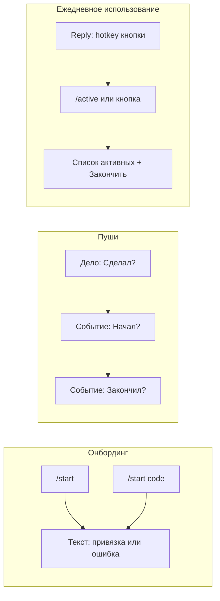

# UI: Telegram (бот)

Схематические отрисовки экранов и элементов бота. Формат: описание + ASCII/псевдографика или блоки. Цель — однозначно реализовать экран.

---

## 1. Онбординг

### 1.1 Первое сообщение при /start без кода

Пользователь открывает бота по ссылке без параметра или пишет `/start`.

**Сообщение бота (текст):**
```
Привет! Я бот для трекинга дел и привычек.

Чтобы начать, зайди на сайт [URL], нажми «Войти через Telegram» и открой меня по ссылке с кодом — так мы привяжем твой аккаунт.
```

**Кнопок нет** (или одна кнопка «Открыть сайт» — URL на веб-приложение).

### 1.2 /start с кодом (подтверждение привязки)

Пользователь перешёл по ссылке вида `t.me/<bot>?start=ABC123` (код в start-параметре).

**Сообщение бота при успешной привязке:**
```
Готово! Твой аккаунт привязан к сайту. Можешь вернуться в браузер и настроить расписание и кнопки.
```

**При истёкшем коде:**
```
Код устарел. Запроси новый код на сайте и открой меня снова по новой ссылке.
```

**При уже использованном коде:**
```
Этот код уже использован. Если нужно привязать другой аккаунт — запроси новый код на сайте.
```

---

## 2. Пуш-сообщения (вопросы по расписанию)

### 2.1 Дело (TaskItem)

Одно сообщение от бота с текстом и **inline-кнопками** (InlineKeyboard).

**Текст:**
```
Сделал «Подъём»?
```
(Название — из элемента плана.)

**Кнопки (одна строка):**
| [ Сделал ] | [ Не сделал ] | [ Пропустить ] |

callback_data: короткий префикс + id, например `t_done_<id>`, `t_no_<id>`, `t_skip_<id>`. Ограничение Telegram: не более 64 байт.

**После нажатия:** сообщение можно отредактировать, например «Учтено: Сделал», кнопки убрать.

### 2.2 Событие — старт (EventItem, первый пуш)

**Текст:** `Начал «Учёба» (09:00–11:00)?`

**Кнопки:** [ Начал ] [ Не начал ] — callback например `e_s_yes_<id>`, `e_s_no_<id>`.

### 2.3 Событие — финиш (EventItem, второй пуш)

**Текст:** `Закончил «Учёба»?`

**Кнопки:** [ Закончил ] [ Пропустил ] — callback `e_e_ok_<id>`, `e_e_skip_<id>`.

---

## 3. Клавиатура / меню (быстрые кнопки)

### 3.1 Reply-клавиатура (под полем ввода)

Кнопки горячих активностей плюс служебная:

```
+------------------+------------------+
|  YouTube         |  Работа          |
+------------------+------------------+
|  Что сейчас идёт |                  |
+------------------+------------------+
```

- Нажатие «YouTube» / «Работа» — старт или стоп сессии.
- «Что сейчас идёт» — показать список активных сессий (раздел 4).

Альтернатива: команда `/active` вместо кнопки «Что сейчас идёт».

---

## 4. Экран «Незавершённые активности»

**Текст сообщения (пример):**
```
Сейчас идёт:

• YouTube — с 14:30 (45 мин)
• Работа — с 09:00 (3 ч 15 мин)
```

Если активных сессий нет:
```
Нет активных сессий. Нажми кнопку активности, чтобы начать трекать.
```

**Кнопки (inline):** по одной на каждую сессию — «Закончить [название]», callback например `fin_<session_id>`. Лимит 64 байта.

---

## 5. Подтверждения после hotkey-действий

**После старта сессии:**
```
Запущено: YouTube. Нажми ещё раз или «Закончить» в списке активных, когда закончишь.
```

**После остановки сессии:**
```
Остановлено: YouTube. Длительность: 1 ч 15 мин.
```

Можно использовать answer_callback_query с текстом всплывающего уведомления.

---

## 6. Сводная схема (Mermaid)



---

## 7. Ограничения Telegram

- **callback_data**: не более 64 байт. Короткие префиксы и числовые id.
- **Ответ на callback_query**: всегда вызывать answer_callback_query.

Ссылки: [requirements.md](requirements.md), [domain-model.md](domain-model.md).
