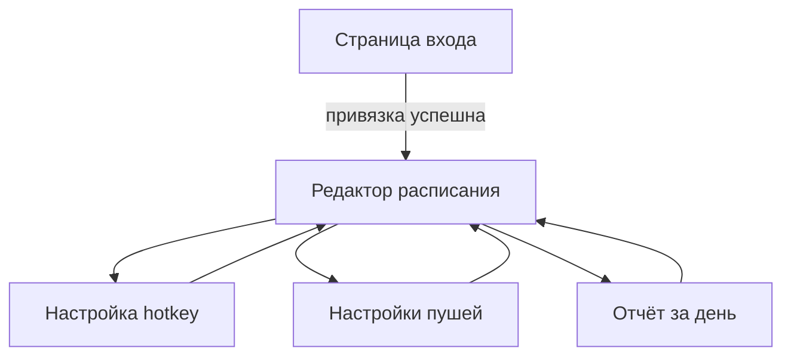

# UI: Веб-приложение

Схематические отрисовки страниц и блоков веб-интерфейса. Формат: описание + ASCII/блоки. Цель — однозначно реализовать экран.

---

## 1. Страница входа

**Назначение**: показать способ авторизации через Telegram и выдать код привязки.

**Макет (блоки):**

```
+----------------------------------------------------------+
|  Control Habits                                          |
+----------------------------------------------------------+
|                                                          |
|   Войти через Telegram                                   |
|                                                          |
|   [  Войти через Telegram  ]   <- кнопка                  |
|                                                          |
|   После нажатия:                                         |
|   +----------------------------------------------------+ |
|   | Открой бота и введи код привязки:                  | |
|   |                                                     | |
|   |   Код:  ABC12X   [ Copy ]                           | |
|   |                                                     | |
|   |   Ссылка:  Открыть бота  (t.me/<bot>?start=ABC12X)  | |
|   |                                                     | |
|   |   Код действителен 10 минут.                        | |
|   +----------------------------------------------------+ |
|                                                          |
|   (опционально: таймер обратного отсчёта, обновление      |
|    страницы при успешной привязке)                       |
|                                                          |
+----------------------------------------------------------+
```

**Элементы:**
- Заголовок / логотип приложения.
- Кнопка «Войти через Telegram»: по нажатию запрос к API → создание кода → отображение кода и ссылки.
- Код: короткая строка (A–Z, a–z, 0–9, _-), копирование в буфер.
- Ссылка «Открыть бота»: `https://t.me/<bot_username>?start=<code>`.
- После привязки (polling или redirect): переход на главную или в настройки.

---

## 2. Редактор расписания

**Назначение**: просмотр и редактирование элементов плана (дела и события) с привязкой к дням недели.

**Макет:**

```
+----------------------------------------------------------+
|  Расписание дня                        [ + Добавить ]    |
+----------------------------------------------------------+
|  Часовой пояс:  [ Europe/Moscow ▼ ]                      |
+----------------------------------------------------------+
|                                                          |
|  07:00   Подъём                          [ Дело ]  [ ⋮ ] |
|  ------------------------------------------------        |
|  08:00   Завтрак                        [ Дело ]  [ ⋮ ] |
|  ------------------------------------------------        |
|  09:00 – 11:00   Учёба                   [ Событие ] [ ⋮ ]|
|  ------------------------------------------------        |
|  12:30   Обед                            [ Дело ]  [ ⋮ ] |
|  ...                                                      |
|                                                          |
+----------------------------------------------------------+
```

**Элементы:**
- Выбор часового пояса (один на пользователя).
- Список элементов: время (одно для дела, диапазон для события), название, тип (дело/событие), действия — редактировать, удалить (⋮ меню).
- Кнопка «Добавить»: открывает форму добавления/редактирования.

**Форма добавления/редактирования элемента:**

```
+---------------------------+
|  Дело / Событие  [ Дело ▼ ]|
|  Название:  [ ____________ ]|
|  Время:     [ 09:00 ]      |  для события ещё [ 11:00 ]
|  Дни недели:               |
|  [ Пн  Вт  Ср  Чт  Пт  Сб  Вс ]  (чекбоксы) |
|  [ Сохранить ]  [ Отмена ]  |
+---------------------------+
```

- Тип: переключатель или select «Дело» / «Событие».
- Для дела: одно поле времени.
- Для события: начало и конец (или начало + длительность).
- Дни недели: чекбоксы или мультиселект.

---

## 3. Настройки пушей

**Назначение**: включить/выключить уведомления, тихие часы.

**Макет:**

```
+----------------------------------------------------------+
|  Уведомления в Telegram                                  |
+----------------------------------------------------------+
|  Пуши по расписанию    [ Вкл ▼ ]   (или переключатель)   |
|  Тихие часы (не слать):                                   |
|    С    по    [ 22:00 ]   до   [ 07:00 ]                  |
|  (опционально: только для будних и т.д.)                 |
+----------------------------------------------------------+
|  [ Сохранить ]                                           |
+----------------------------------------------------------+
```

**Элементы:**
- Вкл/выкл общих пушей.
- Тихие часы: время «от» и «до» в локальном времени пользователя (или чекбокс «не использовать»).

---

## 4. Настройка hotkey-кнопок

**Назначение**: список активностей, которые отображаются в боте как быстрые кнопки; порядок и подпись.

**Макет:**

```
+----------------------------------------------------------+
|  Быстрые кнопки в боте                 [ + Добавить ]      |
+----------------------------------------------------------+
|  Активность        Подпись на кнопке   Порядок   Действия |
|  --------------------------------------------------------|
|  YouTube           YouTube                 1     [ ↑ ↓ ] [ ⋮ ] |
|  Работа            Работа                  2     [ ↑ ↓ ] [ ⋮ ] |
|  Чтение            Чтение                  3     [ ↑ ↓ ] [ ⋮ ] |
+----------------------------------------------------------+
```

**Элементы:**
- Таблица или список: активность (название из справочника активностей), подпись на кнопке (label), порядок (смена стрелками или числом).
- «Добавить»: выбор активности из каталога (или создание новой) + подпись + позиция.
- Меню (⋮): удалить из hotkeys, редактировать подпись.

**Каталог активностей** (отдельный блок или модальное окно):
- Список созданных пользователем активностей с типом (hotkey/regular).
- Создание новой: название, тип. Hotkey-активности можно добавлять в быстрые кнопки.

---

## 5. Отчёт за день

**Назначение**: просмотр запланированного и фактов за выбранную дату.

**Макет:**

```
+----------------------------------------------------------+
|  Отчёт за день              [ 2026-03-06 ▼ ]  [ ← → ]    |
+----------------------------------------------------------+
|  Запланировано              Факт                           |
|  --------------------------------------------------------|
|  07:00 Подъём               Сделал (07:02)                |
|  08:00 Завтрак              Не сделал (—)                 |
|  09:00–11:00 Учёба          Начал 09:05, Закончил 10:58  |
|  12:30 Обед                 —                             |
|  ...                                                        |
|  --------------------------------------------------------|
|  Интервалы (hotkey):                                       |
|  YouTube    14:30 – 15:45   (1 ч 15 мин)                  |
|  Работа     09:00 – 12:15   (3 ч 15 мин)                  |
+----------------------------------------------------------+
```

**Элементы:**
- Выбор даты: date picker или стрелки «предыдущий/следующий день».
- Таблица/список: колонка «Запланировано» (время + название + тип), колонка «Факт» (статус + время ответа если есть).
- Блок «Интервалы»: сессии по hotkey-активностям за этот день с длительностью.

---

## 6. Навигация (общая)

**Вариант простой навигации (MVP):**

- Верхняя панель или боковое меню: «Расписание» | «Быстрые кнопки» | «Уведомления» | «Отчёт».
- После входа пользователь попадает на «Расписание» или на дашборд с кратким днём и ссылками.

```
+----------------------------------------------------------+
|  Control Habits    [ Расписание ] [ Кнопки ] [ Уведомления ] [ Отчёт ] |
+----------------------------------------------------------+
|  (контент выбранной страницы)                             |
+----------------------------------------------------------+
```

---

## 7. Сводная схема страниц (Mermaid)



---

## 8. Ссылки

- Требования к сценариям: [prd.md](prd.md), [requirements.md](requirements.md).
- API и данные: [system-design.md](system-design.md), [modules.md](modules.md).
